## Configure monsoon dashboards in Grafana
Grafana comes with several [dashboard templates](https://grafana.com/grafana/dashboards/) and configuration options, user can freely choose any of them, Following is an example of configuration of Grafana dashboards.\
Monsoon deploys 2 targets on the SONiC host, first one [node_exporter](https://prometheus.io/docs/guides/node-exporter/) running on 9100 and sonic_exporter is running on 9101 port, both of these targets serves different matrices, In this example we configure 2 different dashboards for each target.
  ### node_exporter dashboard
  There are many pre-built dashboard [templates available for node_exporter](https://grafana.com/grafana/dashboards/?search=Node+Exporter) in this example we are using [Node Exporter Full](https://grafana.com/grafana/dashboards/1860) template this can be imported in Grafana using it code 1860 as follows.
  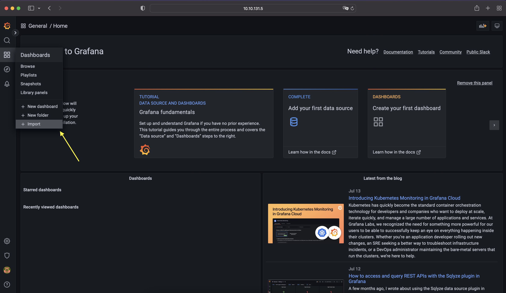

  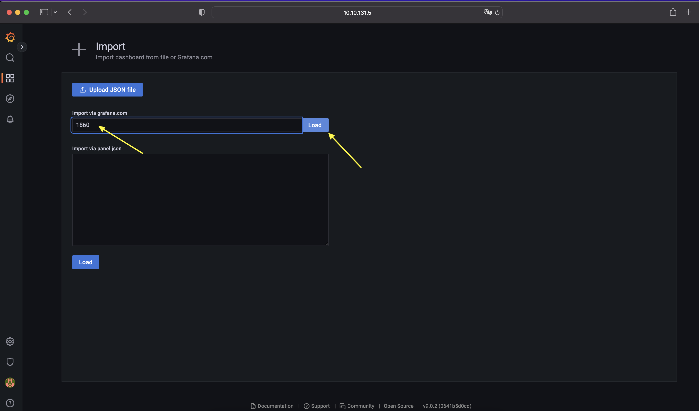

  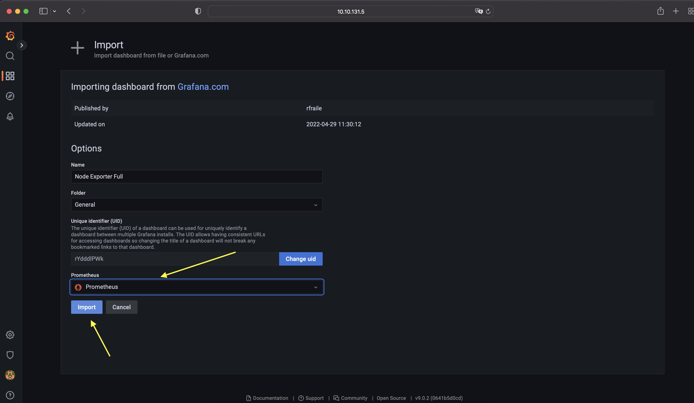

  

  ### sonic_exporter dashboard
  Currently sonic_exporter serves a number of metrices, those sonic specific metrices can be idetified in Grafana with prefix 'sonic'. Using those SONiC specific metrices user can create his own dashboard here is an example for a single metric 'sonic_interface_temperature_celsius':
  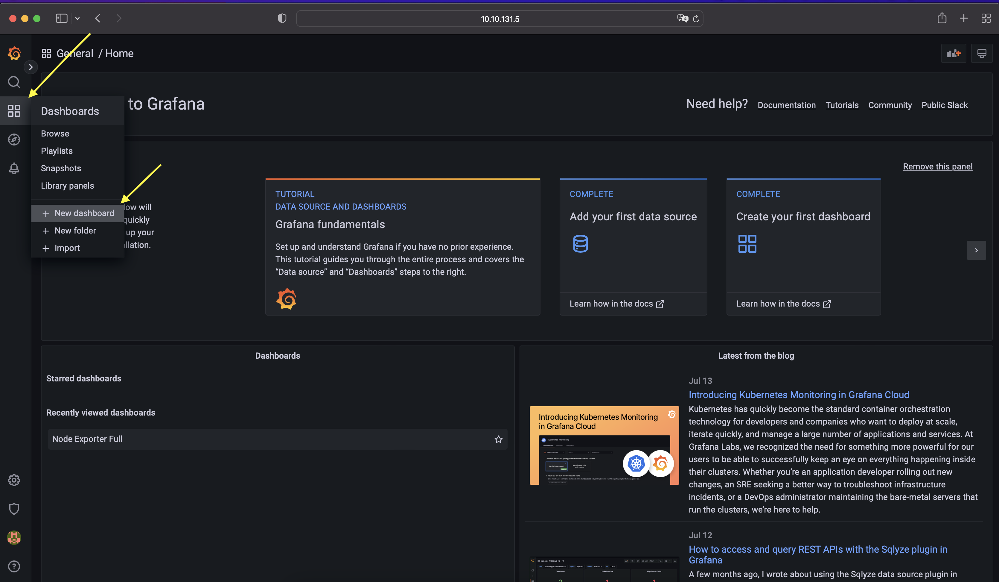

  

  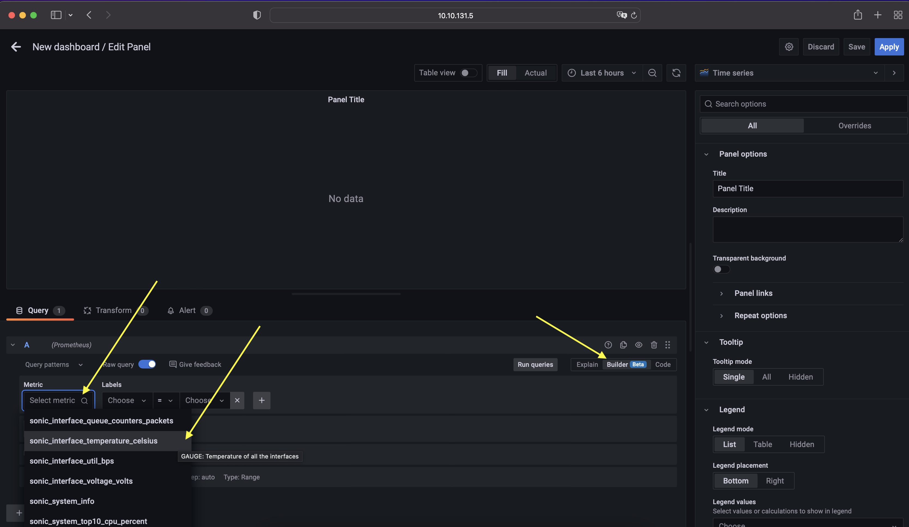

  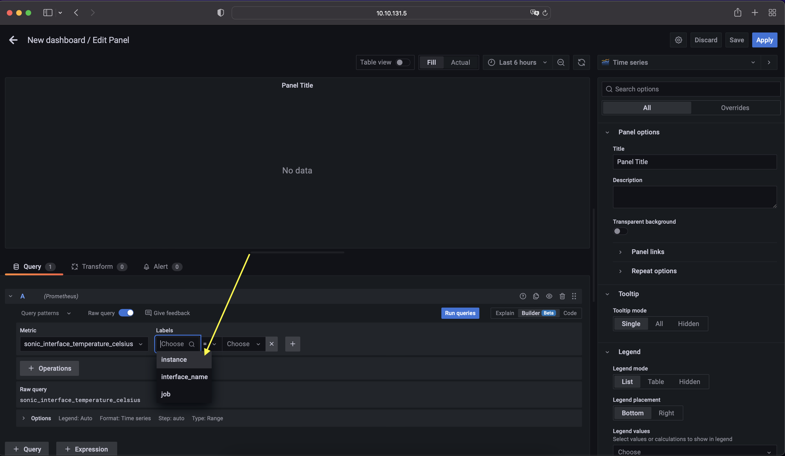

  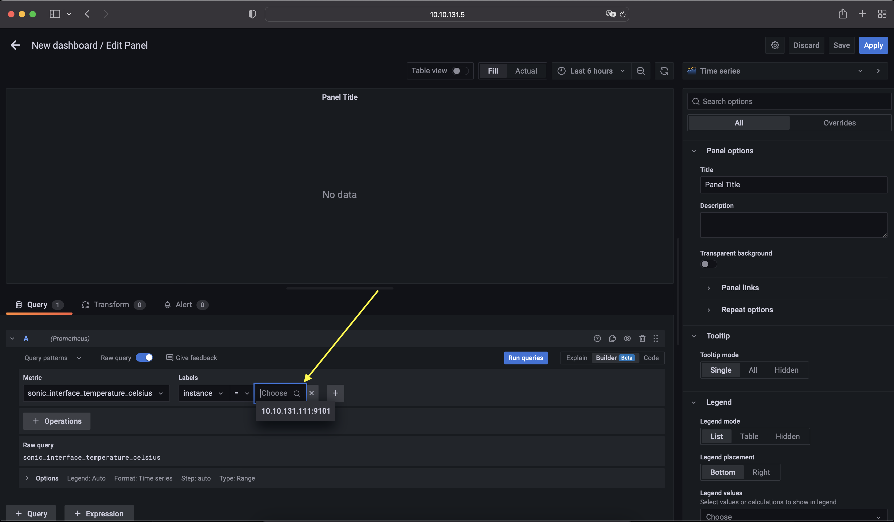

  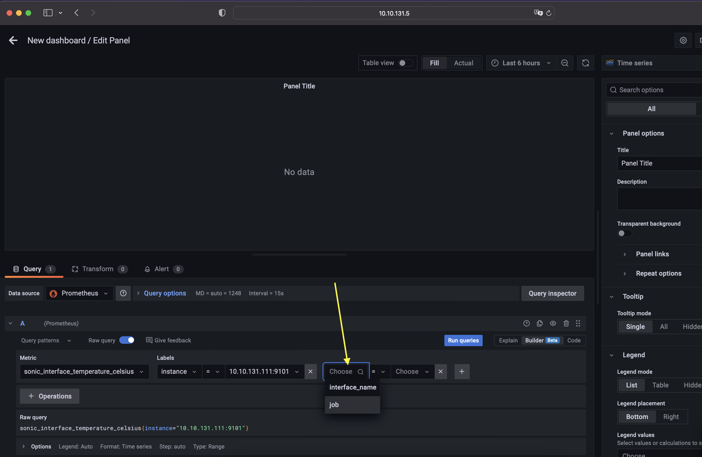

  

  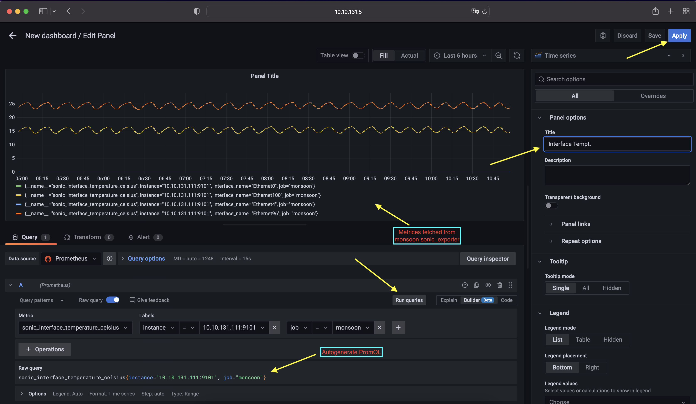

  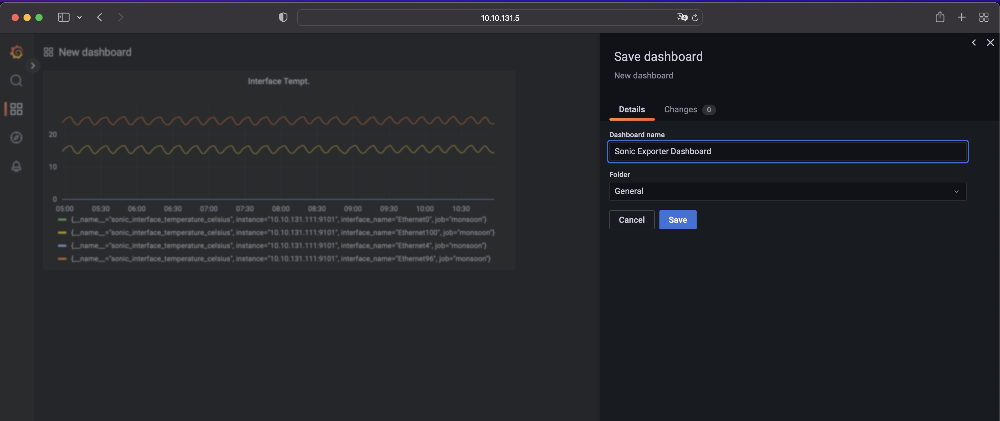

  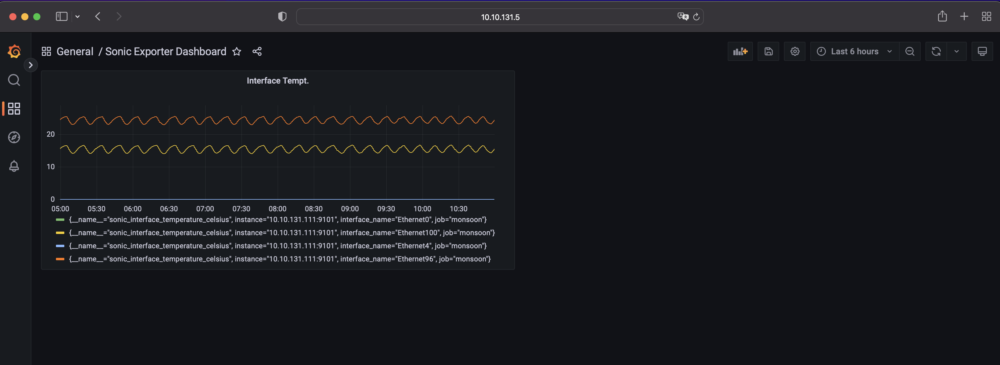
  
  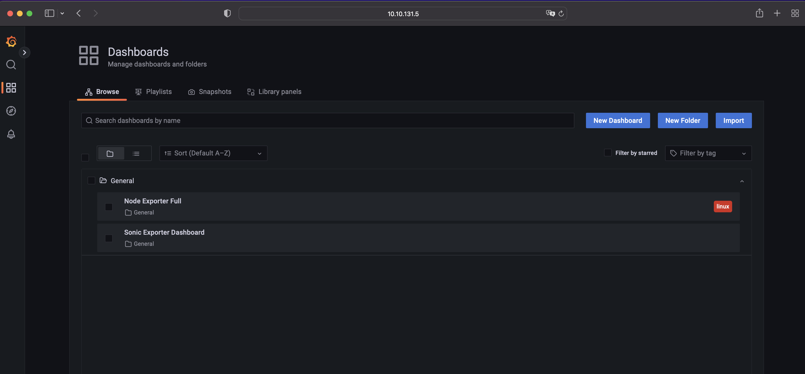
